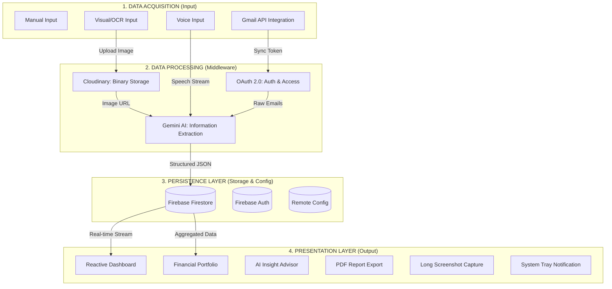

# 🌊 Alur Kerja Aplikasi & Metodologi (Teknik Informatika) v1.0.6

Dokumen ini menjelaskan arsitektur sistem, aliran data, dan metodologi ilmiah yang diterapkan dalam pengembangan aplikasi Camelio sebagai objek penelitian Teknik Informatika.

---

## 1. Arsitektur Sistem & Alur Kerja Data

Aplikasi ini mengadopsi arsitektur **Client-Server** dengan pola pemrosesan data **Input -> Processing -> Storage -> Visualization**.

### **A. Akuisisi Data (Input)**
Data primer diperoleh melalui empat metode utama:
1.  **Direct Interaction**: Input manual oleh pengguna.
2.  **Voice Recognition**: Pemanfaatan `speech_to_text` untuk menangkap perintah suara.
3.  **Digital Image Processing**: Pengambilan gambar struk fisik.
4.  **API Integration**: Penarikan data transaksi otomatis dari email konfirmasi pembayaran (E-Wallet/Banking) melalui **Gmail API**.

### **B. Pemrosesan Data (Processing)**
Pemrosesan dilakukan secara *asynchronous* di awan:
1.  **Image Handling**: Gambar struk disimpan di **Cloudinary**. URL gambar diproses oleh **Large Language Model (LLM)** untuk ekstraksi teks tanpa memerlukan engine OCR lokal yang berat.
2.  **Information Extraction (NLP)**: Model **Gemini 1.5 Flash** bertindak sebagai mesin inferensi untuk melakukan klasifikasi kategori dan ekstraksi entitas (Nama Toko, Tanggal, Nominal) dari data tidak terstruktur.

---

## 2. Metodologi Penelitian & Pengembangan

Dalam konteks Skripsi Teknik Informatika, aplikasi ini menerapkan beberapa metode ilmiah dan standar industri:

### **A. Natural Language Processing (NLP) & Named Entity Recognition (NER)**
Aplikasi menerapkan metode **NER** berbasis AI untuk mengenali entitas spesifik dalam teks transaksi. Metode ini jauh lebih unggul dibanding *RegEx* konvensional karena mampu memahami konteks kalimat dan variasi format struk belanja yang beragam.

### **B. Software Development Life Cycle (SDLC) - Rapid Application Development (RAD)**
Pengembangan menggunakan metode **RAD** yang menekankan pada prototipe cepat dan iterasi berdasarkan feedback pengguna (melalui fitur *User Rating* di dalam aplikasi).

### **C. Software Architecture: MVVM (Model-View-ViewModel)**
Pemisahan *concern* menggunakan pola **MVVM**:
- **Model**: Definisi entitas data (`transaction_model.dart`).
- **View**: Komponen UI deklaratif Flutter.
- **ViewModel (Provider)**: Logika bisnis dan state management yang menjembatani Data dan UI.
Metode ini meningkatkan *maintainability* dan memudahkan proses *unit testing*.

### **D. Service Locator & Dependency Injection (DI)**
Menerapkan **Inversion of Control (IoC)** menggunakan library `GetIt`. Metode ini memastikan manajemen memori yang efisien dengan mengontrol siklus hidup objek (*Singleton/Factory*) di seluruh aplikasi.

### **E. Real-time Database & Stream Persistence**
Menggunakan **Reactive Programming** dengan Firestore Streams. Sistem ini memastikan sinkronisasi data antar perangkat bersifat *real-time*. Setiap penambahan transaksi atau perubahan saldo dompet segera mencerminkan pembaruan di halaman Portofolio dan Dashboard secara instan tanpa perlu memuat ulang (*pull-to-refresh*).

### **F. Cloud Computing Strategy (Serverless Architecture)**
Menerapkan konsep **BaaS (Backend as a Service)**. Strategi ini memindahkan beban komputasi berat dan manajemen infrastruktur (AI, Auth, Database Firestore, Remote Config) ke infrastruktur Google (Firebase), sehingga aplikasi tetap ringan dan responsif meskipun dijalankan pada perangkat dengan spesifikasi rendah.

### **G. Keamanan Data & Otorisasi (OAuth 2.0)**
Implementasi standar protokol **OAuth 2.0** untuk integrasi Gmail API. Metode ini menjamin keamanan karena aplikasi tidak pernah melihat atau menyimpan password pengguna, melainkan hanya menggunakan *Access Token* dengan lingkup (*Scope*) terbatas.

### **H. Optimasi UI/UX - Heuristic Evaluation**
Desain UI mengikuti prinsip **Material Design 3** dengan sentuhan **Glassmorphism** untuk meningkatkan estetika modern. Responsivitas diuji menggunakan berbagai resolusi layar untuk memastikan konsistensi visual.

---

## 3. Teknologi yang Digunakan (Technology Stack)

Sistem ini dikembangkan menggunakan berbagai teknologi *front-end* dan *back-end* yang dimuat pada spesifikasi `pubspec.yaml` dan dokumen arsitektur, meliputi:

### A. Front-End & Pengembangan Aplikasi
*   **Framework**: Flutter (Bahasa Dart) untuk pengembangan aplikasi seluler lintas platform (Android/iOS).
*   **State Management & Arsitektur**: `provider` (untuk state management reaktif) dan `get_it` (sebagai Service Locator dan *Dependency Injection*).
*   **UI/UX & Visual**: `glassmorphism` (efek estetika modern), `fl_chart` (pembuatan grafik portofolio), dan `google_fonts` (tipografi premium).

### B. Backend & Cloud Infrastructure (BaaS)
*   **Database**: Firebase Cloud Firestore (Database NoSQL untuk penyimpanan riwayat transaksi secara *real-time*).
*   **Otentikasi**: Firebase Authentication terintegrasi dengan `google_sign_in` dan `sign_in_with_apple`.
*   **Konfigurasi Keamanan**: Firebase Remote Config (Penyimpanan dinamis API Key tanpa disematkan di kode sumber aplikasi).
*   **Media Storage**: Cloudinary API (Penyimpanan dan optimasi ukuran resolusi berkas gambar struk).

### C. Kecerdasan Buatan (Artificial Intelligence) & NLP
*   **LLM Engine**: Google Gemini 1.5 Flash (via *package* `google_generative_ai`).
*   **Computer Vision**: OCR (Optical Character Recognition) untuk membedah teks dari gambar struk berbasis model Gemini Vision.
*   **Voice Recognition**: Modul `speech_to_text` untuk menangkap suara manusia.

### D. Integrasi Eksternal
*   **Sinkronisasi Email**: Gmail API yang diakses melalui otorisasi aman standar OAuth 2.0 (`googleapis_auth`).

---

## 4. Tahapan Pelaksanaan Proyek (Metodologi RAD)

Sejalan dengan metode *Rapid Application Development* (RAD) dan pendekatan *Design Science Research* (DSR), pelaksanaan pengembangan proyek dilakukan melalui 4 tahapan utama:

1.  **Requirements Planning (Perencanaan Syarat)**
    *   Menganalisis urgensi pencatatan manual pada manajemen keuangan personal dan UMKM.
    *   Studi literatur tentang kapabilitas pengenalan teks (OCR) dan model bahasa besar (LLM).
    *   Mendefinisikan kebutuhan sistem dan fungsionalitas kunci (Scan, Suara, Chat, Gmail Sync).
2.  **User Design (Desain Sistem & Pengguna)**
    *   Perancangan prototipe User Interface (UI) berbasis prinsip Material Design.
    *   Merancang arsitektur database (Flat-Collection pada Firestore) dan diagram UML.
    *   Pengujian awal struktur perintah (Prompt Engineering) yang akan digunakan pada Gemini AI.
3.  **Construction (Konstruksi)**
    *   Pengembangan *front-end* aplikasi menggunakan Flutter.
    *   Implementasi logika bisnis menggunakan arsitektur MVVM (Model-View-ViewModel).
    *   Integrasi SDK Firebase, pemanggilan API Google Gemini, dan *setup* API Gmail.
4.  **Cutover (Implementasi & Evaluasi)**
    *   Pengujian aplikasi secara menyeluruh dan *deployment* prototipe awal.
    *   Evaluasi akurasi mesin kecerdasan buatan dalam mengekstrak parameter transaksi (harga dan nama barang).
    *   Perbaikan dan finalisasi sistem.

---

## 5. Rencana Pengujian (Testing Plan)

Pengujian sistem dilakukan guna memastikan setiap fungsi dapat beroperasi sesuai perancangan teknis dan meminimalkan galat (*error*):

1.  **Black-Box Testing (Pengujian Fungsionalitas)**
    *   Pengujian validasi form login, pencatatan manual, dan perhitungan kalkulasi total saldo portofolio pada antarmuka pengguna tanpa membedah struktur kodenya.
2.  **AI Accuracy Validation (Validasi Akurasi AI)**
    *   Melakukan uji banding ketepatan ekstraksi *Optical Character Recognition* (OCR) dari sampel puluhan struk belanja yang dipindai terhadap nominal aslinya.
    *   Pengujian akurasi penafsiran bahasa natural AI atas input *Voice* dan Teks Chat.
3.  **Unit Testing**
    *   Pengujian terisolasi (*mock test*) terhadap kelas `TransactionProvider` dan fungsi sinkronisasi Gmail Service untuk memastikan pengelolaan data statis stabil.
4.  **User Acceptance Testing (UAT)**
    *   Evaluasi langsung pada sampel kelompok pengguna (Personal/UMKM) menggunakan skenario dunia nyata untuk melihat seberapa efisien aplikasi dapat beradaptasi terhadap kebiasaan mereka.

---

## 6. Timeline Proyek (Project Timeline)

Penyelesaian tugas skripsi ini direncanakan bergulir secara inkremental dalam kurun waktu 5 bulan:

| Bulan | Fase / Kegiatan Utama | Target Capaian (*Milestone*) |
| :---: | :--- | :--- |
| **Bulan 1** | **Penyusunan Proposal & Perencanaan**   - Kajian literatur AI & OCR   - Pembuatan proposal skripsi | Proposal disetujui, dan *requirements* sistem terdefinisi lengkap. |
| **Bulan 2** | **Desain Sistem & UI/UX**   - Merancang Diagram UML & Database   - Implementasi UI statis (Flutter) | Desain aplikasi selesai dan *environment* proyek Flutter siap di-_build_. |
| **Bulan 3** | **Konstruksi Sistem (Tahap 1)**   - Integrasi Firebase Auth & Firestore   - Pembuatan modul transaksi dasar | Pengguna bisa melakukan register, login, dan *input* transaksi manual. |
| **Bulan 4** | **Konstruksi Sistem (Tahap 2 - AI & Integrasi)**   - Integrasi Google Gemini (Vision & Text)   - Sinkronisasi OAuth 2.0 Gmail | Fitur pintar (Scan Struk, Voice, Chat AI, Gmail Sync) fungsional. |
| **Bulan 5** | **Pengujian & Finalisasi Laporan**   - Pelaksanaan Black-box, UAT, dan Uji AI   - Penulisan Laporan Akhir Skripsi | *Bug* sistem tuntas teratasi, buku skripsi final, dan siap untuk disidangkan. |

---

*Dokumen ini diperbarui untuk Versi 1.0.6 - Juni 2026*
*Disusun sebagai referensi teknis penulisan Laporan Skripsi.*
