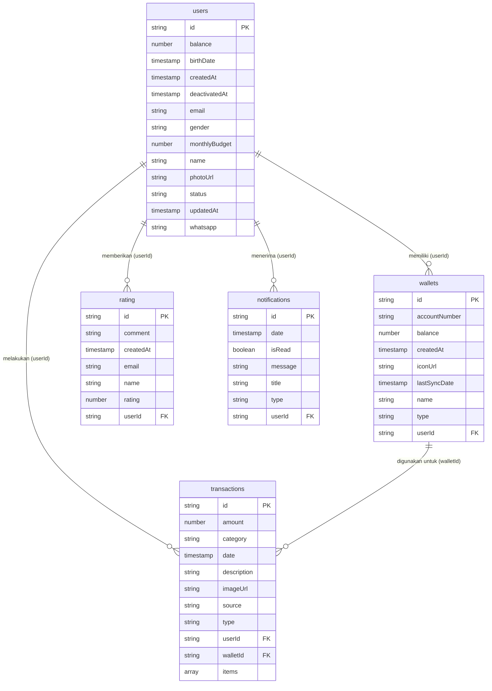

# 🗄️ Entity Relationship Diagram (ERD) - Database Firestore

Dokumen ini berisi struktur ERD (Entity Relationship Diagram) dari database Firebase Firestore untuk aplikasi Camelio Finance. Struktur ini **telah diverifikasi dan disinkronkan** berdasarkan data aktual yang ada di dalam Firestore Cloud.

Firestore menggunakan struktur data NoSQL berbasis **Koleksi (Collection)** -> **Dokumen (Document)** -> **Fields (Data)**.

---

## 📊 Visualisasi ERD (Mermaid)

---

## 📝 Detail Atribut Koleksi (Collection)

### 1. Collection: `users`
Koleksi ini menyimpan data profil dan preferensi akun pengguna.
- `balance`: *Number*
- `birthDate`: *Timestamp*
- `createdAt`: *Timestamp*
- `deactivatedAt`: *Timestamp*
- `email`: *String*
- `gender`: *String*
- `monthlyBudget`: *Number*
- `name`: *String*
- `photoUrl`: *String*
- `status`: *String*
- `updatedAt`: *Timestamp*
- `whatsapp`: *String*

### 2. Collection: `wallets`
Koleksi ini menyimpan data dompet digital atau akun perbankan milik pengguna.
- `accountNumber`: *String*
- `balance`: *Number*
- `createdAt`: *Timestamp*
- `iconUrl`: *String*
- `lastSyncDate`: *Timestamp*
- `name`: *String*
- `type`: *String*
- `userId`: *String* (Foreign Key ke koleksi `users`)

### 3. Collection: `transactions`
Koleksi ini mencatat riwayat transaksi pengeluaran atau pemasukan.
- `amount`: *Number*
- `category`: *String*
- `date`: *Timestamp*
- `description`: *String*
- `imageUrl`: *String*
- `source`: *String*
- `type`: *String*
- `userId`: *String* (Foreign Key ke koleksi `users`)
- `walletId`: *String* (Foreign Key ke koleksi `wallets`)
- `items`: *Array (List of Maps)* -> Berisi detail barang yang dibeli (`name`, `qty`, `price_unit`, `line_total`)

### 4. Collection: `rating`
Koleksi ini menyimpan ulasan atau feedback aplikasi dari pengguna.
- `comment`: *String*
- `createdAt`: *Timestamp*
- `email`: *String*
- `name`: *String*
- `rating`: *Number*
- `userId`: *String* (Foreign Key ke koleksi `users`)

### 5. Collection: `notifications`
Koleksi ini menampung log notifikasi sistem yang dikirimkan kepada pengguna.
- `date`: *Timestamp*
- `isRead`: *Boolean*
- `message`: *String*
- `title`: *String*
- `type`: *String*
- `userId`: *String* (Foreign Key ke koleksi `users`)
