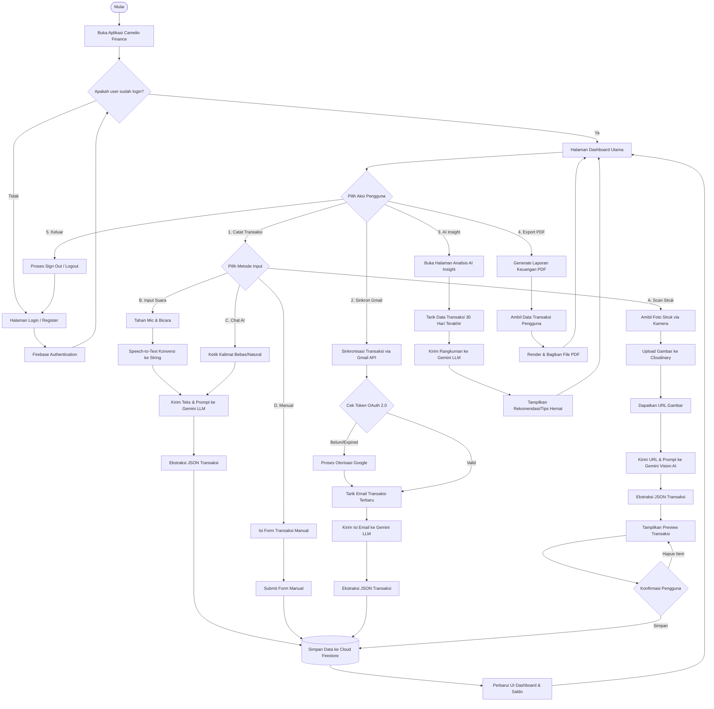
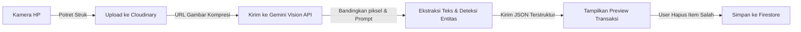
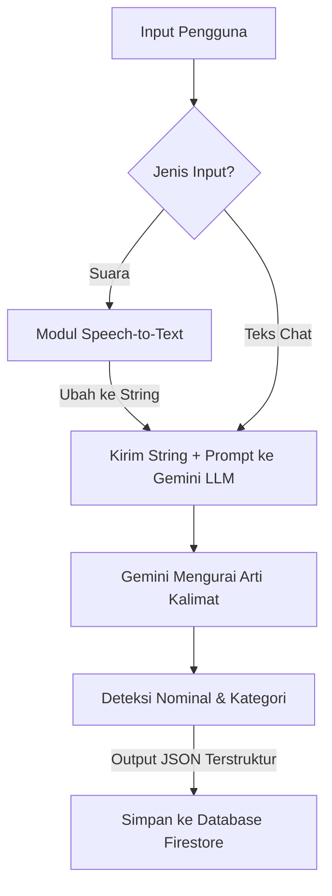
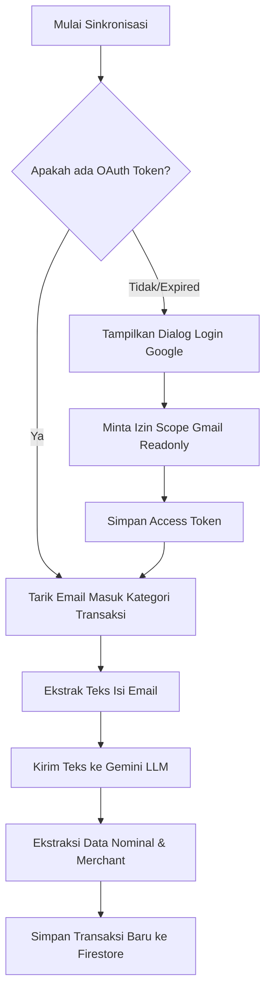
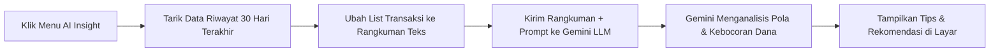
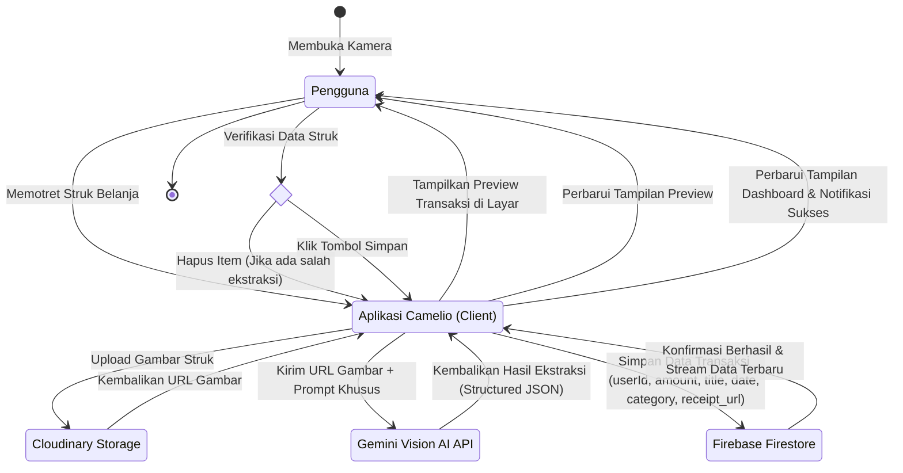
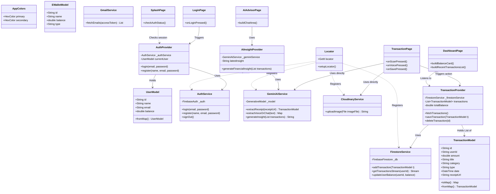
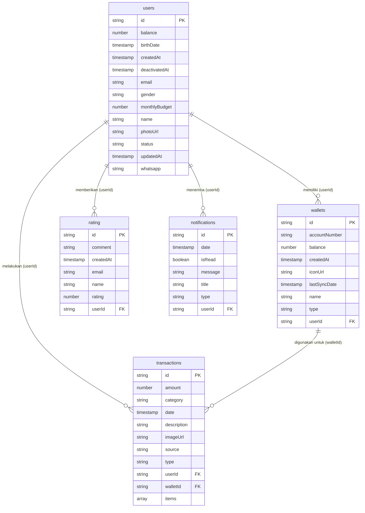

# 🗺️ Dokumentasi Arsitektur Sistem, Flowchart, dan UML (Camelio Finance)

Dokumen ini berisi dokumentasi teknis sistem aplikasi **Camelio Finance** (Smart Finance App). Dokumentasi ini dirancang menggunakan format **Mermaid** untuk rendering visual dan dilengkapi dengan penjelasan akademis dalam Bahasa Indonesia untuk kebutuhan penulisan Laporan Skripsi/Tugas Akhir.

---

## 🏗️ 1. Arsitektur Sistem (System Architecture)

Aplikasi Camelio Finance dirancang menggunakan arsitektur **Client-Server** dengan pola pemrosesan data berbasis awan (*Cloud-based processing*). Beban komputasi yang berat (seperti pengenalan pola gambar struk, konversi suara ke transaksi, dan analisis sentimen pengeluaran) dialihkan dari perangkat pengguna (*client-side*) ke penyedia eksternal (*cloud-side*) melalui API (Serverless Architecture).

```mermaid
graph TD
    classDef client fill:#e1f5fe,stroke:#03a9f4,stroke-width:2px;
    classDef cloud fill:#efebe9,stroke:#8d6e63,stroke-width:2px;
    classDef firebase fill:#fff9c4,stroke:#fbc02d,stroke-width:2px;
    classDef ai fill:#ede7f6,stroke:#5e35b1,stroke-width:2px;

    subgraph Client ["Client Side (Mobile Application)"]
        FlutterApp["Flutter Mobile App (Camelio Finance)"]:::client
        SQLite["Local Cache & State Management"]:::client
    end

    subgraph MediaStorage ["Media Storage Service"]
        Cloudinary["Cloudinary API (Upload & Compress Struk)"]:::cloud
    end

    subgraph FirebaseEcosystem ["Firebase Backend-as-a-Service (BaaS)"]
        FirebaseAuth["Firebase Authentication (Sesi Pengguna)"]:::firebase
        Firestore["Cloud Firestore (NoSQL Database)"]:::firebase
        RemoteConfig["Firebase Remote Config (Gemini API Key)"]:::firebase
    end

    subgraph GoogleAPIs ["Google API Ecosystem"]
        GeminiAI["Google Gemini AI API (Gemini 1.5 Flash)"]:::ai
        GmailAPI["Gmail API (OAuth 2.0 Integration)"]:::ai
    end

    %% Connections
    FlutterApp -->|1. Request Auth/Session| FirebaseAuth
    FlutterApp -->|2. Get Gemini API Key| RemoteConfig
    FlutterApp -->|3. Upload Receipt Photo| Cloudinary
    Cloudinary -->|4. Return Compressed Image URL| FlutterApp
    FlutterApp -->|5. Send Image URL / Voice Text / Prompt| GeminiAI
    GeminiAI -->|6. Return Structured JSON| FlutterApp
    FlutterApp -->|7. Authorize & Fetch Emails| GmailAPI
    GmailAPI -->|8. Return Transaction Emails| FlutterApp
    FlutterApp -->|9. Write & Stream Financial Data| Firestore
    Firestore -.->|Real-time Data Update| FlutterApp
```



### Penjelasan Arsitektur:
1.  **Client (Flutter App)**: Bertindak sebagai antarmuka utama pengguna. Aplikasi bertanggung jawab menangkap input (kamera, mic, teks) dan menampilkan visualisasi grafik.
2.  **Firebase Authentication**: Mengelola autentikasi pengguna secara aman untuk memastikan pemisahan data antar pengguna.
3.  **Firebase Remote Config**: Digunakan untuk mengunduh API Key Google Gemini secara dinamis ke aplikasi agar API Key tidak bocor di dalam kode sumber (*hardcoded*).
4.  **Cloudinary (Media Storage)**: Berkas gambar struk diunggah ke Cloudinary terlebih dahulu untuk dikompresi agar ukuran gambar menjadi ringan saat dibaca oleh AI.
5.  **Google Gemini AI API**: Model **Gemini 1.5 Flash** digunakan untuk tiga fungsi utama:
    *   **Vision AI (OCR)**: Membaca teks dari URL gambar struk dan menyusunnya menjadi format JSON.
    *   **NLP & Chat AI**: Memahami percakapan teks bebas atau transkrip suara pengguna dan mengekstrak entitas transaksi.
    *   **Financial Insight Engine**: Menganalisis riwayat transaksi 30 hari terakhir untuk memberikan rekomendasi finansial.
6.  **Gmail API**: Menghubungkan kotak masuk Gmail pengguna menggunakan otorisasi OAuth 2.0 untuk menarik surel bukti pembayaran dari bank/e-wallet lalu memprosesnya melalui Gemini AI.
7.  **Cloud Firestore**: Berfungsi sebagai database NoSQL utama yang menyimpan seluruh data profil, transaksi, rekening, dan preferensi pengguna dengan sinkronisasi *real-time stream*.

---

## 🔄 2. Alur Kerja Sistem (Flowchart)

### A. Alur Kerja Global (Global System Flowchart)
Flowchart ini memetakan jalannya aplikasi secara menyeluruh dari pertama kali aplikasi dibuka hingga semua fitur utama diakses.



---

### B. Detil Alur Fitur AI & API

#### 1. Alur Kerja Scan Struk (OCR + Gemini Vision AI)
Alur ini berfokus pada proses konversi struk fisik menjadi data transaksi otomatis menggunakan kamera dan Gemini Vision AI.



#### 2. Alur Kerja Input Suara & Chat AI (Gemini LLM)
Menjelaskan bagaimana kalimat suara (*Speech*) atau teks bebas diurai menjadi variabel transaksi terstruktur (`amount`, `category`, `title`).



#### 3. Alur Kerja Sinkronisasi Gmail API
Menjelaskan sinkronisasi email masuk dari penyedia layanan keuangan (Bank/E-Wallet) menggunakan integrasi API.



#### 4. Alur Kerja AI Insight (Rekomendasi Hemat)
Proses penganalisisan riwayat transaksi untuk menghasilkan tips keuangan kustom.



---

## 📊 3. Unified Modeling Language (UML)

### A. Use Case Diagram
Use Case Diagram mendefinisikan batas sistem serta interaksi antara pengguna dengan fungsionalitas yang disediakan oleh aplikasi Camelio Finance secara menyeluruh.

```mermaid
leftToRightDirection
actor User as "Pengguna (Personal / UMKM)"

rectangle SystemBoundaries as "Aplikasi Camelio Finance" {
    %% Core & Profile
    usecase UC_Auth as "Melakukan Login / Register"
    usecase UC_Profil as "Mengelola Profil (Edit Foto & Detail)"
    
    %% Dashboard & Transaksi
    usecase UC_Dashboard as "Melihat Dashboard & Saldo"
    usecase UC_Portofolio as "Melihat Portofolio & Grafik"
    usecase UC_Riwayat as "Melihat Riwayat Transaksi"
    
    %% Input Transaksi
    usecase UC_Catat as "Mencatat Transaksi Baru"
    usecase UC_Scan as "Scan Struk (OCR & Vision AI)"
    usecase UC_Voice as "Input via Suara (Voice to Text)"
    usecase UC_Chat as "Input via Teks Pintar (Chat AI)"
    usecase UC_Manual as "Input Manual"
    
    %% Advanced Features
    usecase UC_Gmail as "Sinkronisasi Transaksi via Gmail API"
    usecase UC_Insight as "Melihat Analitik AI Insight"
    usecase UC_Export as "Export Laporan Transaksi (PDF)"
    usecase UC_Wallet as "Manajemen E-Wallet & Rekening"
    
    %% Settings & Support
    usecase UC_Settings as "Pengaturan Sistem (Tema, Notifikasi, Bahasa)"
    usecase UC_Privacy as "Mengelola Privasi & Izin"
    usecase UC_Support as "Melihat Bantuan, FAQ, & Kebijakan"
    usecase UC_Rating as "Memberikan Rating & Ulasan"
    usecase UC_Signout as "Keluar Aplikasi (Sign Out)"
}

%% Connections (Actor to Use Cases)
User --> UC_Auth
User --> UC_Dashboard
User --> UC_Portofolio
User --> UC_Riwayat
User --> UC_Catat
User --> UC_Gmail
User --> UC_Insight
User --> UC_Export
User --> UC_Wallet
User --> UC_Profil
User --> UC_Settings
User --> UC_Privacy
User --> UC_Support
User --> UC_Rating
User --> UC_Signout

%% Extends
UC_Catat <|-- UC_Scan : <<extends>>
UC_Catat <|-- UC_Voice : <<extends>>
UC_Catat <|-- UC_Chat : <<extends>>
UC_Catat <|-- UC_Manual : <<extends>>
```

---

### B. Activity Diagram (Pencatatan Transaksi via Scan Struk AI)
Menggambarkan alur aktivitas dinamis saat pengguna menggunakan fitur Scan Struk.



---

### C. Class Diagram (Struktur MVVM)
Menunjukkan struktur kelas dalam kode sumber Flutter Camelio Finance yang memisahkan antara UI (*View*), Logika Keadaan (*ViewModel/Provider*), dan Akses Data (*Model/Service*).



---

### D. Sequence Diagram (Proses Input Scan Struk)
Sequence Diagram ini memetakan interaksi berurutan dan pesan antar objek sepanjang jalannya fitur Scan Struk, dari pemilihan kamera oleh aktor hingga penyimpanan data ke database.

```mermaid
sequenceDiagram
    autonumber
    actor User as Pengguna
    participant View as TransactionPage (UI)
    participant Provider as TransactionProvider (ViewModel)
    participant Cloudinary as CloudinaryService (Service)
    participant Gemini as GeminiAiService (Service)
    participant Firestore as FirestoreService (Service)
    database DB as Cloud Firestore

    User->>View: Buka Kamera & Potret Struk
    View->>Cloudinary: uploadImage(imageFile)
    activate Cloudinary
    Cloudinary-->>View: Kembalikan URL Gambar (receipt_url)
    deactivate Cloudinary

    View->>Gemini: extractReceipt(receipt_url)
    activate Gemini
    Gemini->>Gemini: Kirim URL + Prompt ke Gemini Vision AI API
    Gemini-->>View: Kembalikan structured JSON (amount, title, category, date)
    deactivate Gemini

    View->>User: Tampilkan Preview Transaksi (bisa hapus item salah)
    User->>View: Konfirmasi & Klik Simpan
    View->>Provider: saveTransaction(transactionData)
    activate Provider
    Provider->>Firestore: addTransaction(transaction)
    activate Firestore
    Firestore->>DB: Tulis data dokumen baru
    DB-->>Firestore: Sukses menyimpan data
    Firestore-->>Provider: Sukses
    deactivate Firestore
    
    Provider->>Firestore: updateUserBalance(userId, newBalance)
    activate Firestore
    Firestore->>DB: Update field balance di users/userId
    DB-->>Firestore: Sukses update balance
    Firestore-->>Provider: Sukses
    deactivate Firestore
    
    Provider-->>View: Perbarui State & Selesai
    deactivate Provider
    View-->>User: Tampilkan Notifikasi Sukses & kembali ke Dashboard
```

---

## 🗄️ 4. Skema Database (NoSQL Firestore Schema)

Aplikasi menggunakan database Cloud Firestore dengan arsitektur **Flat Root Collection** untuk mempercepat kueri (*query performance*) dan meminimalisir pembacaan bersarang (*deep nesting operations*). Diagram hubungan entitas (ERD NoSQL) adalah sebagai berikut:



### Rincian Koleksi Firestore:
1.  **`users`**: Menyimpan profil dan preferensi akun pengguna.
2.  **`wallets`**: Koleksi penyimpanan dompet digital atau akun perbankan milik pengguna.
3.  **`transactions`**: Mencatat riwayat transaksi pengeluaran atau pemasukan.
4.  **`rating`**: Menyimpan ulasan atau feedback aplikasi dari pengguna.
5.  **`notifications`**: Menampung log notifikasi sistem yang dikirimkan kepada pengguna.
